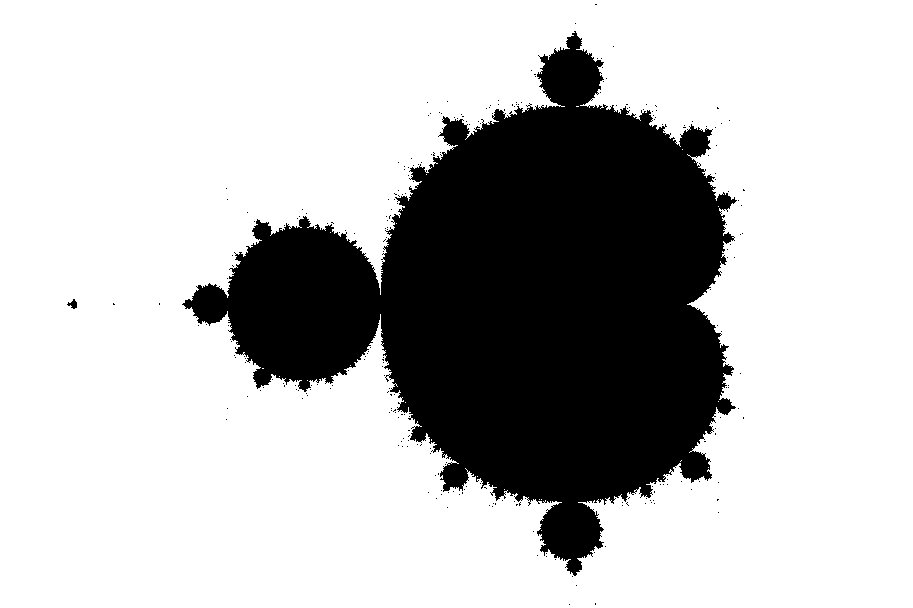

# Mandelbrot set

### Run

```bash
mandelbrot_set DEST THREADS ITERATIONS RESOLUTION UPPER_LEFT LOWER_RIGHT
```
```text
 DEST -- image destination (dest.png)
 THREADS -- threads count (16)
 ITERATIONS -- amount of iterations to test whether a point belongs to Mandelbrot set (100)
 RESOLUTION -- image resolution in pixels (3000x2000)
 UPPER_LEFT -- complex plane upper left coordinate (-2.0,1.0)
 LOWER_LEFT -- complex plane lower right coordinate (1.0,-1.0)
```

### Example

```bash
./mandelbrot_set dest.png 10 100 30000x2000 -2.0,1.0 1.0,-1.0
```
#### or 
```bash
./run.sh
```


